<h1 align="center">Proyecto Programación II — Chatbot</h1>

  Proyecto del curso <b>Programación II</b>, Universidad Católica del Uruguay. 
  Integrantes: <b>Horacio Díaz</b>, <b>Andrés Charpentié</b> y <b>Andrés Rodriguéz</b>.

## 🗂️ Organización del equipo

La planificación y división de tareas se realiza en **Trello**

🔗 [Tablero Trello](https://trello.com/invite/b/68ee454952ea5cb366736671/ATTI47495b8d46b377d3fb5435bbe7c2c4ea144F20E7/proyecto-p2)

## 🧩 Diagrama de Clases (Mermaid)

El diseño de clases fue hecho con **Mermaid** para tener una idea de qué clases serían necesarias para llevar a cabo este proyecto previamente a hacerlo.

🔗 [Abrir en Mermaid](https://www.mermaidchart.com/app/projects/d3c42d9d-aa06-4e81-b08e-e9ba599f56fb/diagrams/e8dd9a10-86d6-4e84-8737-7c0717ca9ea4/version/v0.1/edit)

```mermaid
---
config:
  theme: mc
  look: neo
---
classDiagram
direction TB
    class Cliente {
	    +string Id
	    +string Nombre
	    +string Apellido
	    +string Telefono
	    +string Correo
	    +string Genero
	    +List~string~ Etiquetas
	    +string FechaDeNacimiento
	    +Cliente(id: string, nombre: string, apellido: string, telefono: string, correo: string)
	    +CambiarNombre(nuevoNombre: string) void
	    +CambiarApellido(nuevoApellido: string) void
	    +CambiarTelefono(nuevoTelefono: string) void
	    +CambiarCorreo(nuevoCorreo: string) void
	    +AsignarGenero(nuevoGenero: string) void
	    +AsignarEtiqueta(nuevaEtiqueta: string) void
	    +AsignarFechaDeNacimiento(nuevaFecha: string) void
	    +ToString() string
    }
    class RepoClientes {
	    - List~Cliente~ Clientes
	    + IEnumerable~Cliente~ Clientes2
	    - RepoEtiquetas etiquetas
	    - RepoUsuarios usuarios
	    + RepoClientes(RepoEtiquetas etiquetas, RepoUsuarios usuarios)
	    + AgregaCliente(Cliente cliente)
	    + EliminarCliente(Cliente cliente)
	    + BuscarCliente(string atributo, string valorBusqueda) List~Cliente~
	    + BuscarUnCliente(string ClienteId) Cliente
    }
    class RepoEtiquetas {
	    - List~string~ Etiquetas
	    + void AgregarEtiqueta(string etiqueta)
	    + bool BuscarEtiqueta(string etiqueta)
    }
    class RepoUsuarios {
	    +List Usuarios
	    +List Administradores
	    +List Vendedores
	    +List ClientesTotales
	    +AgregarUsuario(usuario: Usuario) void
	    +EliminarUsuario(usuario: Usuario) void
	    +BuscarUsuario(id: string) Usuario
	    +BuscarVendedor(id: string) Vendedor
	    +BuscarAdministrador(id: string) Administrador
	    +BuscarCliente(id: string) Cliente
    }
    class Vendedor {
	    + List~Cliente~ Clientes
	    + string Id
	    + string NombreCompleto
	    + Vendedor(string id, string nombre)
	    + AsignarCliente(Cliente cliente, Vendedor vendedor)
    }
    class Usuario {
	    - string ID
	    - string Nombre
	    - List~Interaccion~ InteraccionesUsuario
	    - List~Venta~ TotalVentas
	    - List~Venta~ VentaCliente
	    - List~Cotizacion~ CotizacionesUsuario
	    + Usuario(string id, string nombre)
	    + Recordatorio(string que, string cuando) void
	    + VentaClienteAdd(Venta venta) void
	    + AgregarCotizacion(Cotizacion cotizacion) void
	    + AgregarInteraccion(Interaccion interaccion) void
    }
    class Administrador {
	    + List~Usuario~ UsuariosSuspendidos
	    + Administrador(string id, string nombre)
    }
    class Interaccion {
	    + string Notas
	    + Cliente Cliente
	    + Usuario Usuario
	    + string Tema
	    + DateTime Fecha
	    + TipoInterracion Tipo
	    + string Contenido
	    + string Lugar
	    + Interaccion(Usuario usuario, Cliente cliente, string tema, string contenido, string cuando = "00/00/0000")
	    + AgergarNotas(string notas) void
	    # FechaIncorrecta(DateTime fecha) void
    }
    class Venta {
	    +Cliente Cliente
	    +string Producto
	    +DateTime Fecha
	    +string Importe
	    +Venta(cliente: Cliente, producto: string, fecha: DateTime, importe: string)
	    +Resumen() string
    }
    class Cotizacion {
	    + Cliente Cliente
	    + DateTime Fecha
	    + string Importe
	    + Cotizacion(Cliente cliente, DateTime fecha, string importe)
	    + Resumen() string
    }
    class TipoInterracion {
	    Mensaje
	    Llamada
	    Reunion
	    Correo
	    Nada
    }
    class Llamadas {
	    + Llamadas(Usuario usuario, Cliente cliente, string tema, string llamada, string cuando)
    }
    class Mensajes {
	    + Mensajes(Usuario usuario, Cliente cliente, string tema, string mensaje, string cuando)
    }
    class Correos {
	    + Correos(Usuario usuario, Cliente cliente, string tema, string correo, string cuando)
    }
    class Reunion {
	    + Reunion(Usuario usuario, Cliente cliente, string tema, string lugar, string reunion, string cuando)
	    # FechaIncorrecta(DateTime fecha) void
    }
    class RepoCotizaciones {
	    - List~Cotizacion~ Cotizaciones
	    + void AgregarCotizacion(Cliente cliente, string cuando, string precio, Usuario usuario)
    }
    class RepoInteracciones {
	    - List~Interaccion~ Interacciones
	    + IEnumerable~Interaccion~ Interacciones2
	    + Interaccion BuscarInteraccion(Usuario usuario, string tipo, string tema)
	    + List~Interaccion~ BuscarInteraccion(Usuario usuario, Cliente cliente, string tipo="", string fecha1="")
	    + void AgregarInteraccion(Interaccion interaccion, Usuario usuario)
	    + Dictionary~Cliente,Interaccion~ UltimasInteraccionesClientes(Usuario usuario)
	    + void eliminarinteraciones()
    }
    class RepoVentas {
	    - List~Venta~ Ventas
	    + void AgregarVenta(Cliente cliente, string cuando, string precio, string producto, Usuario usuario)
    }
    class Fachada {
	    - instancia : Fachada
	    - ClientesContacto : Dictionary~
	    - Etiquetas : RepoEtiquetas
	    - Clientes : RepoClientes
	    - Interacciones : RepoInteracciones
	    - Cotizaciones : RepoCotizaciones
	    - Ventas : RepoVentas
	    - Usuarios : RepoUsuarios
	    - UsuariosSuspendidos : List
	    + Instancia : Fachada
	    + RegistarMensaje(clienteId, mensaje, tema, usuarioId, cuando) string
	    + RegistrarCorreo(clienteId, correo, tema, usuarioId, cuando) string
	    + RegistarLlamada(clienteId, llamada, tema, usuarioId, cuando) string
	    + RegistarReunion(clienteId, reunion, tema, usuarioId, cuando, lugar) string
	    + AgregarNota(nota, tipointeraccion, tema, usuarioId) string
	    + InteraccionesCliente(clienteId, usuarioId, tipo, fecha) string
	    + InterraccionClienteAusente(usuarioId) string
	    + Panel(usuarioId) string
	    + AgregarClienteContacto(usuarioId, clienteId) string
	    + VerClienteContacto(usuarioId) string
	    + CrearEtiqueta(etiqueta, idUsuario) string
	    + AgregarEtiquetaCliente(clienteId, etiqueta, usuarioId) string
	    + RegistrarVenta(clienteId, producto, fecha, precio, usuarioId) void
	    + RegistarCotizacion(clienteId, fecha, precio, usuarioId) void
	    + CrearUsuario(id, nombre, idAdmin) string
	    + SuspenderUsuario(idSuspender, idAdmin) string
	    + EliminarUsuario(idEliminar, idAdmin) string
	    + AsignarClienteAOtroVendedor(idVendedorActual, idVendedorNuevo, nombreCliente, apellidoCliente) void
	    + BuscarClientesFachada(atributo, valorBusqueda) List~Cliente~
	    + CrearNuevoCliente(id, nombre, apellido, telefono, correo) Cliente
	    + ModificarInfo(id, atributo, nuevoValor) void
	    + EliminarClienteFachada(id) void
	    + VerClientes() RepoClientes
	    + BuscarUsuario(usuarioId) Usuario
	    + RegistrarVentaCliente(clienteId, producto, fecha, precio, usuarioId) string
	    + TotalDeVentasEnPeriodo(usuarioId, fechaInicioTexto, fechaFinTexto) string
    }
    class Excepciones {
    }
    class InvalidDateException {
	    +InvalidDateException(string mensaje = null)
    }
    class EmptyStringException {
	    +EmptyStringException(string mensaje = null)
    }
    class Exception {
    }

	<<enumeration>> TipoInterracion
	<<singleton>> Fachada

    Excepciones <|-- InvalidDateException
    Excepciones <|-- EmptyStringException
    InvalidDateException --|> Exception
    EmptyStringException --|> Exception
    RepoClientes "1" --> "*" Cliente
    RepoClientes "1" --> "1" RepoEtiquetas
    RepoClientes "1" --> "1" RepoUsuarios
    Vendedor --|> Usuario
    Administrador --|> Usuario
    Vendedor "1" --> "*" Cliente
    Administrador "1" --> "*" Usuario
    Usuario "1" o-- "*" Interaccion
    Usuario "1" o-- "*" Venta
    Usuario "1" o-- "*" Cotizacion
    Interaccion "1" o-- "1" Cliente
    Interaccion "1" o-- "1" Usuario
    Interaccion *-- TipoInterracion
    Llamadas --|> Interaccion
    Mensajes --|> Interaccion
    Correos --|> Interaccion
    Reunion --|> Interaccion
    Cotizacion "1" o-- "1" Cliente
    RepoUsuarios --> "0..*" Usuario
    RepoInteracciones --> Interaccion
    RepoInteracciones --> Usuario
    RepoInteracciones --> Cliente
    RepoVentas --> Venta
    RepoVentas --> Cliente
    RepoVentas --> Usuario
    RepoCotizaciones "1" --> "*" Cotizacion

	style Cliente stroke:#FF5978,fill:#FFDFE5,color:#8E2236

	style Vendedor stroke:#46EDC8,fill:#DEFFF8,color:#378E7A
	style Usuario stroke:#374D7C,fill:#E2EBFF,color:#374D7C
	style Administrador stroke:#46EDC8,fill:#DEFFF8,color:#378E7A
	style Venta stroke:#FBB35A,fill:#FFEFDB,color:#8F632D
	style Cotizacion stroke:#46EDC8,fill:#DEFFF8,color:#378E7A

	style Reunion stroke:#FF5978,fill:#FFDFE5,color:#8E2236

	style Fachada stroke:#46EDC8,fill:#DEFFF8,color:#378E7A

	class RepoClientes:::Sky
	class RepoEtiquetas:::Peach
	class RepoUsuarios:::Peach
	class Interaccion:::Peach
	class TipoInterracion:::Sky
	class Llamadas:::Aqua
	class Mensajes:::Rose
	class Correos:::Sky
	class RepoCotizaciones:::Aqua
	class RepoInteracciones:::Peach
	class RepoVentas:::Rose
	class Excepciones:::Peach
	class InvalidDateException:::Rose
	class EmptyStringException:::Sky
	class Exception:::Aqua

	classDef Sky :,stroke-width:1px,stroke-dasharray:none,stroke:#374D7C,fill:#E2EBFF,color:#374D7C,stroke-width:1px,stroke-dasharray:none,stroke:#374D7C,fill:#E2EBFF,color:#374D7C,stroke-width:1px,stroke-dasharray:none,stroke:#374D7C,fill:#E2EBFF,color:#374D7C,stroke-width:1px,stroke-dasharray:none,stroke:#374D7C,fill:#E2EBFF,color:#374D7C
	classDef Peach :,stroke-width:1px,stroke-dasharray:none,stroke:#FBB35A,fill:#FFEFDB,color:#8F632D,stroke-width:1px,stroke-dasharray:none,stroke:#FBB35A,fill:#FFEFDB,color:#8F632D,stroke-width:1px,stroke-dasharray:none,stroke:#FBB35A,fill:#FFEFDB,color:#8F632D,stroke-width:1px,stroke-dasharray:none,stroke:#FBB35A,fill:#FFEFDB,color:#8F632D,stroke-width:1px,stroke-dasharray:none,stroke:#FBB35A,fill:#FFEFDB,color:#8F632D
	classDef Aqua :,stroke-width:1px,stroke-dasharray:none,stroke:#46EDC8,fill:#DEFFF8,color:#378E7A,stroke-width:1px,stroke-dasharray:none,stroke:#46EDC8,fill:#DEFFF8,color:#378E7A,stroke-width:1px,stroke-dasharray:none,stroke:#46EDC8,fill:#DEFFF8,color:#378E7A
	classDef Rose :,stroke-width:1px,stroke-dasharray:none,stroke:#FF5978,fill:#FFDFE5,color:#8E2236,stroke-width:1px,stroke-dasharray:none,stroke:#FF5978,fill:#FFDFE5,color:#8E2236,stroke-width:1px,stroke-dasharray:none,stroke:#FF5978,fill:#FFDFE5,color:#8E2236

```

## 💻 Comandos e historias

| Historias | Comandos                                                                                                                                                                        | Ejemplo                                                                                                                                                                                                                                                                                                                                                                                                                                                                       |
| --------- |---------------------------------------------------------------------------------------------------------------------------------------------------------------------------------|-------------------------------------------------------------------------------------------------------------------------------------------------------------------------------------------------------------------------------------------------------------------------------------------------------------------------------------------------------------------------------------------------------------------------------------------------------------------------------|
| Como usuario quiero crear un nuevo cliente con su información básica: nombre, apellido, teléfono y correo electrónico, para poder contactarme con ellos cuando lo necesite. | <b>!crearCliente</b> clienteId nombre apellido telefono correo                                                                                                                  | <b>!crearCliente</b> C1,Tony,Gonzales,099287345,juan@correo.com                                                                                                                                                                                                                                                                                                                                                                                                               | 
| Como usuario quiero modificar la información de un cliente existente, para mantenerla actualizada. | <b>!modfInfo</b> clienteId atributo nuevoValor                                                                                                                                  | <b>!crearCliente</b> C2,Juan,Martinez,099287345,martinezjuan@correo.com <b>!modfInfo</b> C2,nombre,Horacio                                                                                                                                                                                                                                                                                                                                                                |
| Como usuario quiero eliminar un cliente, para mantener limpia la base de datos. | <b>!eliminarCliente</b> id                                                                                                                                                      | <b>!crearCliente</b> C3,Kevin,Rodriguez,099281245,kevinrod@correo.com <b>!eliminarCliente</b> C3                                                                                                                                                                                                                                                                                                                                                                          |
| Como usuario quiero buscar clientes por nombre, apellido, teléfono o correo electrónico, para identificarlos rápidamente. | <b>!buscarCliente</b> atributo busqueda                                                                                                                                         | <b>!crearCliente</b> C4,Romualdo,Perez,092287345,perezromualdo@correo.com <b>!buscarCliente</b> nombre,Romualdo                                                                                                                                                                                                                                                                                                                                                           |
| Como usuario quiero ver una lista de todos mis clientes, para tener una vista general de mi cartera. | <b>!verClientes</b>                                                                                                                                                             | <b>!verClientes</b>                                                                                                                                                                                                                                                                                                                                                                                                                                                           |
| Como usuario quiero registrar llamadas enviadas o recibidas de clientes, incluyendo cuándo fueron y de qué tema trataron, para poder saber mis interacciones con los clientes. | <b>!registrarLlamada</b> clienteId llamada tema usuarioId fecha  | <b>!crearAdministrador</b> A1,Pablo <b>!crearUsuario</b> U1,Lucas,A1 <b>!crearCliente</b> C1,Juan,Pinocho,099765432,JuanP@gmail.com <b>!registrarLlamada</b> C1,hola,saludo,U1,10/11/2025 <b>!interaccionCliente</b> C1,U1,llamada,10/11/2025                                                                                                                                                                                                                 | 
| Como usuario quiero registrar reuniones con los clientes, incluyendo cuándo y dónde fueron, y de qué tema trataron, para poder saber mis interacciones con los clientes. | <b>!registrarReunion</b> clienteId reunion tema usuarioId fecha lugar  | <b>!crearAdministrador</b> A1,Pablo <b>!crearUsuario</b> U1,Lucas,A1 <b>!crearCliente</b> C1,Juan,Pinocho,099765432,JuanP@gmail.com <b>!registrarReunion</b> C1,hola todo bien,saludo,U1,10/11/2025,Marte <b>!interaccionCliente</b> C1,U1,reunion,10/11/2025                                                                                                                                                                                                 |
| Como usuario quiero registrar mensajes enviados a o recibidos de los clientes, incluendo cuándo y de qué tema fueron, para poder saber mis interacciones con los clientes. | <b>!registrarMensaje</b> clienteId mensaje tema usuarioId fecha       | <b>!crearAdministrador</b> A1,Pablo <b>!crearUsuario</b> U1,Lucas,A1 <b>!crearCliente</b> C1,Juan,Pinocho,099765432,JuanP@gmail.com <b>!registrarMensaje</b> C1,hola todo bien,saludo,U1,11/11/2025 <b>!interaccionCliente</b> C1,U1,mensaje,11/11/2025                                                                                                                                                                                                       |
| Como usuario quiero registrar correos electrónicos enviados a o recibidos de los clientes, incluendo cuándo y de qué tema fueron, para poder saber mis interacciones con los clientes. | <b>!registrarCorreo</b> clienteId correo tema usuarioId fecha  | <b>!crearAdministrador</b> A1,Pablo <b>!crearUsuario</b> U1,Lucas,A1 <b>!crearCliente</b> C1,Juan,Pinocho,099765432,JuanP@gmail.com <b>!registrarCorreo</b> C1,hola todo bien,saludo,U1,12/11/2025 <b>!interaccionCliente</b> C1,U1,correo,12/11/2025                                                                                                                                                                                                         |
| Como usuario quiero agregar notas o comentarios a las llamadas, reuniones, mensajes y correos enviados o recibidos de los clientes, para tener información adicional de mis interacciones con los clientes. | <b>!agregarNota</b> tipoInteraccion tema usuarioId  | <b>!crearAdministrador</b> A1,Pablo <b>!crearUsuario</b> U1,Lucas,A1 <b>!crearCliente</b> C1,Juan,Pinocho,099765432,JuanP@gmail.com <b>!registrarCorreo</b> C1,hola todo bien,saludo,U1,12/11/2025 <b>!agregarNota</b> este saludo es fue muy bueno,correo,saludo,U1 <b>!interaccionCliente</b> C1,U1,correo,12/11/2025                                                                                                                                   |
| Como usuario quiero registrar otros datos de los clientes como género y fecha de nacimiento de los clientes, para realizar campañas y saludarlos en sus cumpleaños. | <b>!modfInfo</b> id atributo nuevoValor                                                                                                                                         | <b>!crearCliente</b> C5,Jovani,Vazquez,099289455,jovanivazquez@correo.com <b>!modfInfo</b> C5,nombre,Rodrigo                                                                                                                                                                                                                                                                                                                                                              |
| Como usuario quiero poder definir etiquetas para poder organizar y segmentar a mis clientes. | <b>!crearEtiqueta</b> usuarioId etiqueta                                                                                                                                        | <b>!crearAdministrador</b> A25,Hector <b>!crearUsuario</b> U1,Franco,A25</b> <b>!crearEtiqueta</b> U1,etiquetaDePrueba                                                                                                                                                                                                                                                                                                                                                |
| Como usuario quiero poder agregar una etiqueta a un cliente, para luego organizar y segmentar mi cartera de clientes. | <b>!agregarEtiqueta</b> clienteId etiqueta usuarioId                                                                                                                            | <b>!crearAdministrador</b> A32,Liliana <b>!crearCliente</b> C6,Edmundo,Gutierrez,0982827315,edmundoguti@correo.com</b> <b>!crearUsuario</b> U20,Alejandro,A32 <b>!crearEtiqueta</b> U1,etiquetaDePrueba  U1,Pepe,A1</b> <b>!agregarEtiqueta</b> C1,etiquetaDePrueba,U1                                                                                                                                                                                    |
| Como usuario quiero poder registrar una venta a un cliente, incluyendo qué le vendí, cuándo se lo vendí y cuánto le cobré, para saber lo que compran los clientes. | <b>!registrarVenta</b> clienteId producto fecha precio usuarioId                                                                                                                | <b>!crearAdministrador</b> A9,Ema9 <b>!crearUsuario</b> U9,Ezequiel9,A9 <b>!crearCliente</b> C9,Jean9,Rodriguez9,099281245,kevinrod@correo.com <b>!registrarVenta</b> C9,ATUN,11/12/2025,100,U9                                                                                                                                                                                                                                                                   |
| Como usuario quiero poder registrar que le envié una cotización a un cliente, cuándo se la mandé y por qué importe es la cotización, para hacer seguimiento de oportunidades de venta. | <b>!registrarCotiz</b> clienteId fecha precio usuarioId                                                                                                                         | <b>!crearAdministrador</b> A10,Ema10 <b>!crearUsuario</b> U10,Ezequiel10,A10 <b>!crearCliente</b> C10,Jean10,Rodriguez10,099281245,kevinrod@correo.com <b>!registrarCotiz</b> C10,11/12/2025,100,U10                                                                                                                                                                                                                                                              |
| Como usuario quiero ver todas las interacciones de un cliente, con o sin filtro por tipo de interacción y por fecha, para entender el historial de la relación comercial. | <b>!interaccionCliente</b> clienteId usuarioId tipo fecha | <b>!crearAdministrador</b> A1,Pablo <b>!crearUsuario</b> U1,Lucas,A1 <b>!crearCliente</b> C1,Juan,Pinocho,099765432,JuanP@gmail.com <b>!registrarCorreo</b> C1,hola todo bien,saludo,U1,12/11/2025 <b>!registrarLlamada</b> C1,nos vimos,despedida,U1,10/11/2025 <b>!interaccionCliente</b> C1,U1,, <b>!interaccionCliente</b> C1,U1,,12/11/2025 <b>!interaccionCliente</b> C1,U1,llamada, <b>!interaccionCliente</b> C1,U1,correo,12/11/2025 |
| Cómo usuario quiero saber los clientes que hace cierto tiempo que no tengo ninguna interacción con ellos, para no peder contacto con ellos. | <b>!clienteAusente</b> usuarioId  | <b>!crearAdministrador</b> A1,Pablo <b>!crearUsuario</b> U1,Lucas,A1 <b>!crearCliente</b> C1,Juan,Pinocho,099765432,JuanP@gmail.com <b>!registrarReunion</b> C1,hola todo bien,saludo,U1,10/10/2024,Marte <b>!clienteAusente</b> U1                                                                                                                                                                                                                           |
| Como usuario quiero saber los clientes que se pusieron en contacto conmigo y no les contesté hace cierto tiempo, para no dejar de responder mensajes o llamadas. | <b>!clienteContactaVer</b> usuarioId   <b>!clienteContactaAgregar</b> usuarioid clienteid   <b>!clienteContactaEliminar</b> usuarioid clienteid | <b>!crearAdministrador</b> A1,Pablo <b>!crearUsuario</b> U1,Lucas,A1 <b>!crearCliente</b> C1,Juan,Pinocho,099765432,JuanP@gmail.com  <b>!clienteContactaAgregar</b> U1,C1   <b>!clienteContactaVer</b> U1                                                                                                                                                                                                                                                     | 
| Como administrador quiero crear usuarios. | <b>!crearUsuario</b> usuarioId nombre adminId                                                                                                                                   | <b>!crearAdministrador</b> A1,Pepe <b>!crearUsuario</b> U1,Ezequiel,A1                                                                                                                                                                                                                                                                                                                                                                                                    |
| Como administrador quiero eliminar usuarios. | <b>!eliminarUsuario</b> usuarioId adminId                                                                                                                                       | <b>!crearAdministrador</b> A2,Andres <b>!crearUsuario</b> U2,Peter,A2 <b>!eliminarUsuario</b> U2,A2                                                                                                                                                                                                                                                                                                                                                                   |
| Como administrador quiero suspender usuarios. | <b>!suspenderUsuario</b> usuarioId adminId                                                                                                                                      | <b>!crearAdministrador</b> A3,Juan <b>!crearUsuario</b> U3,Nahuel,A3 <b>!suspenderUsuario</b> U3,A3                                                                                                                                                                                                                                                                                                                                                                   |
| Como vendedor, quiero poder asignar un cliente a otro vendedor para distribuir el trabajo en el equipo. | <b>!asignarCliente</b> clienteId vendedorId      | <b>!crearVendedor</b> V11,JuanVendedor11 <b>!crearCliente</b> C11,Jean11,Rodriguez11,099281245,kevinrod@correo.com <b> <b>!asignarCliente</b> C11,V11                                                                                                                                                                                                                                                                                                                 |
| Como usuario quiero saber el total de ventas de un periodo dado, para analizar en rendimiento de mi negocio. | <b>!totalVentas</b> usuarioId fechaInicio fechaFin          | <b>!crearAdministrador</b> A12,Juan12 <b>!crearUsuario</b> U12,Nahuel12,A12 <b>!crearCliente</b> C12,Jean12,Rodriguez12,099281245,kevinrod@correo.com <b>!registrarVenta</b> C12,ATUN,11/12/2025,100,U12 <b>!registrarVenta</b> C12,ATUN,12/12/2025,100,U12 <b>!totalVentas</b> U12,11/12/2025,14/12/2025                                                                                                                                                 |
| Como usuario quiero ver un panel con clientes totales, interacciones recientes y reuniones próximas, para tener un resumen rápido. | <b>!panel</b> usuarioId   | <b>!crearAdministrador</b> A1,Pablo <b>!crearUsuario</b> U1,Lucas,A1 <b>!crearCliente</b> C1,Juan,Pinocho,099765432,JuanP@gmail.com <b>!registrarLlamada</b> C1,hola,saludo,U1,30/11/2025 </b>!crearCliente</b> C2,Marta,Mora,099383214,MartaM@gmail.com <b>!registrarMensaje</b> C2,tengo una duda,duda,U1,02/12/2025 <b>!registrarReunion</b> C1,Tenemos que discutir sobre los aliens,extraterestres,U1,10/11/2026,Marte <b>!panel U1          |

### Comandos no requeridos por las historias de usuario

| Comando                                   | Descripción | Ejemplos |
|-------------------------------------------| --- | --- |
| <b>!init</b>                              | Este comando crea un administrador, un usuario, un cliente y un vendedor. Esto para facilitar probar y/o utilizar el resto de comandos. | <b>!init</b> |
| <b>!verUsuarios</b>                       | Muestra los usuarios existentes | <b>!verUsuarios</b> |
| <b>!crearVendedor</b> vendedorId nombre   | Este comando crea un vendedor | <b>!crearVendedor</b> V1,JuanVendedor |
| <b>!crearAdministrador</b> adminId nombre | Este comando crea un Administrador | <b>!crearAdministrador</b> A1,Pepe | 

## 📜 Notas

Los principales desafios que encontramos al trabajar sobre el proyecto fueron la correcta distribución de responsabilidades entre las clases y sus relaciones entre sí, la correcta implementación de los principios SOLID y GRASP, y acostumbrarse a trabajar con Git, que era una herramienta nueva para todos.  
En general, el proyecto fue una buena oportunidad para poner en práctica lo visto en clase, tanto lo que se trata de conceptos como de código. 
